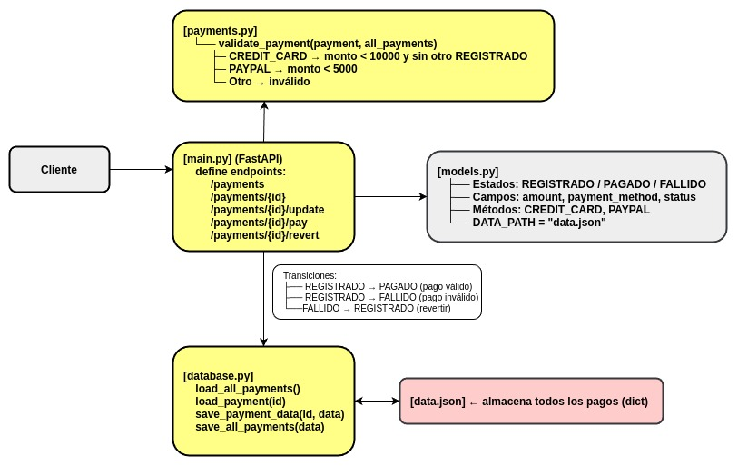

# Examen API de Gestión de Pagos

Esta es la implementación de una API de pagos usando FastAPI, con CI/CD a través de GitHub Actions.

## URL de la API

**API de Producción:** `https://udesa-mia203-exame1.onrender.com/`

## Instrucciones de Ejecución

### 1. Ejecución Local

1.  Clonar el repositorio:
    ```bash
    git clone <tu-repo-url>
    cd <tu-repo-dir>
    ```
2.  (Opcional) Crear un entorno virtual:
    ```bash
    python -m venv venv
    source venv/bin/activate
    ```
3.  Instalar dependencias:
    ```bash
    pip install -r requirements.txt
    ```
4.  Correr la API en modo desarrollo:
    ```bash
    fastapi dev main.py
    ```
5.  Acceder a la documentación interactiva (Swagger UI):
    [http://127.0.0.1:8000/docs](http://127.0.0.1:8000/docs)

### 2. Ejecución de Tests

Para correr la suite de tests automáticos:

```bash
python -m unittest test_app.py
```

## Diagrama del proyecto



## Decisiones de Diseño y Trade-offs

Persistencia (JSON): Usamos el data.json que venia en el codigo de referencia. Es simple pero no es apto para producción ya que el problema es que no maneja concurrencia. Por ejemplo, si dos pagos con tarjeta se validan al mismo tiempo, ambos podrían aprobarse incorrectamente, ya que el archivo no tiene locks. La solución real sería usar una base de datos transaccional (como Postgres) para manejar esto. 

API (Query vs. Body): Seguimos la consigna usando query parameters para enviar datos en los POST (como amount y payment_method). Lo estándar en API REST es mandar estos datos dentro de un JSON body, ya que es mas limpio y fácil de validar.

Logica de Estados: El flujo de estados se implemento con chequeos simples dentro de cada endpoint. Si el flujo fuera mucho más complejo, habria que usar una libreria de maquina de estados para formalizar las transiciones.


## Deploy a Render

Podemos hacer el deploy sobre Render de dos maneras distintas:

### Usando "Auto-Deploy" de Render

Activamos el Auto-Deploy en Render y le indicas que observe la rama production.
No se necesitaria el archivo cd.yml
No se necesitaria el secret RENDER_DEPLOY_HOOK en GitHub.

Cómo funciona: En cuanto GitHub le avisa a Render que hubo un push a production, Render automáticamente busca el código y hace el deploy.

El ci.yml sigue siendo necesario porque eso es lo que te da la validacion antes de hacer el merge.   

Desventaja: Se pierde algo de  control. El deploy se dispara apenas se hace el merge.

### Usando el cd.yml con Deploy Hook

Tiene control total sobre el pipeline de deploy. Por tema de simplicidad y tiempo, decidimos utilizar el auto deploy.


